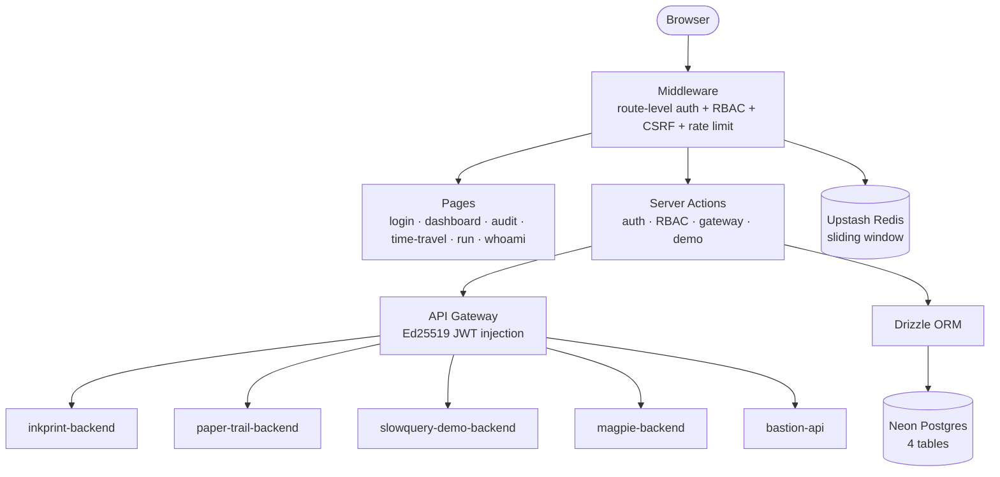
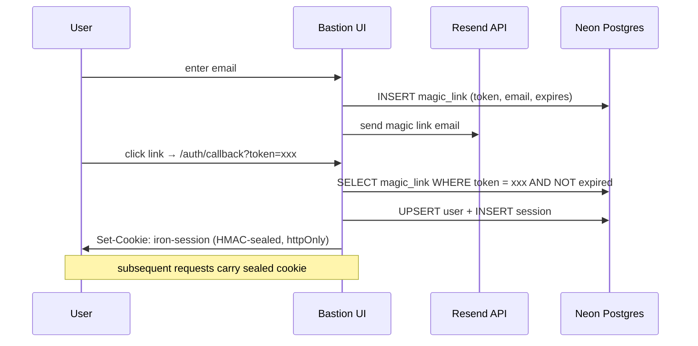
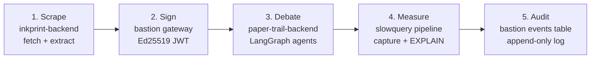
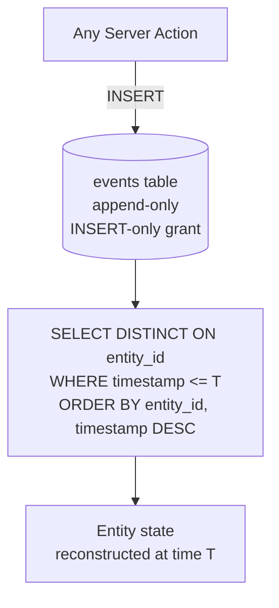

# 🏰 `bastion`

> 🛡️ **Control plane + identity + audit + demo runner for the muizz-lab portfolio.**
> Not a landing page — a full-stack Next.js control plane that proves 5 microservices work together.

🌐 [Live Demo](https://bastion-six.vercel.app) · 📖 [Architecture](docs/ARCHITECTURE.md) · 🎬 [Demo Script](docs/DEMO.md) · ❓ [Why](WHY.md)


[](https://github.com/Abdul-Muizz1310/bastion/actions/workflows/ci.yml)


---

```console
$ open https://bastion-six.vercel.app

[auth]       magic link sent → inbox → callback → session sealed
[registry]   5 services discovered · 4 healthy · 1 cold-starting
[gateway]    Ed25519 JWT minted · TTL 60s · forwarding to paper-trail
[demo]       step 1/5: scrape → sign → debate → measure → audit
[audit]      12 events logged · INSERT-only · no UPDATE/DELETE
[replay]     time-travel to 2026-04-13T09:41:00Z → entity reconstructed
```

---

## 🎯 Why this exists

A portfolio of independent microservices needs proof they work **together**, not just individually. Bastion is that proof — a single entry point that authenticates users, routes traffic through an API gateway, runs a cross-service demo workflow, and logs every action to an append-only audit trail.

It is **not** a landing page. It is a real control plane with real auth, real RBAC, real rate limiting, and a real database.

---

## ✨ Features

- 🔐 Magic link authentication via Resend + iron-session HMAC-sealed cookies
- 👥 3-tier RBAC (admin / editor / viewer) enforced in middleware + `withRole()`
- 📡 Service registry with live health checks for 5 downstream backends
- 🌉 API gateway with Ed25519 JWT injection via jose
- 📝 Append-only audit log — `INSERT`-only DB grant, no `UPDATE` or `DELETE`
- ⏪ Time-travel replay via `DISTINCT ON` — reconstruct entity state at any past timestamp
- 🎬 Integrated 5-step demo runner (scrape → sign → debate → measure → audit)
- 🛡️ 11-item security checklist (RBAC, CSRF double-submit, rate limiting, CSP, httpOnly, no PII in cookies)
- ⏱️ Rate limiting via Upstash Redis sliding window
- 🧪 68 unit tests (Vitest)
- 🚀 Deployed on Vercel

---

## 🏗️ Architecture



### 🔐 Auth flow



### 🎬 Demo runner pipeline



### 📝 Audit + time-travel



---

## 🗂️ Project structure

```
src/
├── app/
│   ├── page.tsx                    # Dashboard — service registry + health
│   ├── layout.tsx                  # Root layout + session provider
│   ├── login/page.tsx              # Magic link login form
│   ├── auth/callback/route.ts      # Magic link callback handler
│   ├── audit/page.tsx              # Append-only audit log viewer
│   ├── time-travel/page.tsx        # DISTINCT ON replay UI
│   ├── run/page.tsx                # 5-step demo runner
│   └── whoami/page.tsx             # Current session info
├── actions/
│   ├── auth.ts                     # Login, logout, session
│   ├── gateway.ts                  # Ed25519 JWT mint + proxy
│   ├── demo.ts                     # 5-step cross-service runner
│   └── audit.ts                    # Append event + time-travel query
├── middleware.ts                    # Auth + RBAC + CSRF + rate limit
├── db/
│   ├── schema.ts                   # Drizzle schema (users, sessions, magic_links, events)
│   └── client.ts                   # Neon connection
├── lib/
│   ├── session.ts                  # iron-session config
│   ├── rbac.ts                     # withRole() guard
│   ├── rate-limit.ts               # Upstash Redis sliding window
│   └── jwt.ts                      # Ed25519 sign/verify via jose
└── components/
    ├── ServiceCard.tsx              # Health-checked service tile
    ├── AuditTable.tsx               # Event log viewer
    ├── TimeTravelSlider.tsx         # Timestamp picker + replay
    └── DemoRunner.tsx               # Step-by-step demo UI
```

---

## 🛠️ Stack

| Concern | Choice |
|---|---|
| **Framework** | Next.js 16 (App Router, Server Actions — no separate backend) |
| **UI** | React 19 · TypeScript strict |
| **Auth** | iron-session HMAC-sealed cookies · magic link via Resend |
| **RBAC** | 3 roles (admin / editor / viewer) · middleware + `withRole()` |
| **Database** | Neon Postgres via Drizzle ORM (4 tables: users, sessions, magic_links, events) |
| **Rate limiting** | Upstash Redis sliding window |
| **JWT** | Ed25519 via jose |
| **Testing** | Vitest (68 unit tests) |
| **Lint / Format** | Biome |
| **Hosting** | Vercel |

---

## 🔐 Security checklist

| # | Control | Implementation |
|---|---|---|
| 1 | RBAC | 3-tier role enforcement in middleware + `withRole()` |
| 2 | CSRF | Double-submit cookie pattern |
| 3 | Rate limiting | Upstash Redis sliding window on auth + API routes |
| 4 | CSP | Content-Security-Policy headers via middleware |
| 5 | httpOnly cookies | iron-session sealed, httpOnly, secure, sameSite=lax |
| 6 | No PII in cookies | Session cookie contains only user ID + role, HMAC-sealed |
| 7 | Magic link expiry | Tokens expire after 15 minutes, single-use |
| 8 | Append-only audit | `INSERT`-only DB grant — no `UPDATE`/`DELETE` on events |
| 9 | JWT short-lived | Ed25519 tokens with 60s TTL |
| 10 | Input validation | Zod schemas on all Server Action inputs |
| 11 | Error boundaries | No stack traces or internal state leaked to client |

---

## 🚀 Run locally

```bash
# 1. clone & install
git clone https://github.com/Abdul-Muizz1310/bastion.git
cd bastion
pnpm install

# 2. env
cp .env.example .env.local
# fill in DATABASE_URL, IRON_SESSION_PASSWORD, RESEND_API_KEY,
# UPSTASH_REDIS_REST_URL, UPSTASH_REDIS_REST_TOKEN

# 3. dev
pnpm dev
# → http://localhost:3000
```

### 📜 Scripts

```bash
pnpm dev          # Next.js dev server
pnpm build        # production build
pnpm start        # production server
pnpm test         # Vitest unit tests
pnpm lint         # Biome check
pnpm format       # Biome write
```

---

## 🧪 Testing

```bash
pnpm test                    # watch mode
pnpm test -- --run           # CI single-run
```

| Metric | Value |
|---|---|
| **Unit tests** | 68 (Vitest) |
| **Methodology** | Red-first spec-TDD. Failing test before every feature. |

---

## 📐 Engineering philosophy

| Principle | How it shows up |
|---|---|
| 🧪 **Spec-TDD** | Every feature ships with a red test first. |
| 🛡️ **Negative-space programming** | Append-only audit (illegal states unrepresentable at DB level), `Literal` role types, Zod at every Server Action boundary. |
| 🏗️ **Separation of concerns** | `app/` thin pages · `actions/` Server Actions · `lib/` pure helpers · `db/` data layer. No cross-layer reaches. |
| 🔤 **Typed everything** | TypeScript strict. Drizzle typed schema. Zod-inferred types. No `any`. |
| 🌊 **Pure core, imperative shell** | RBAC checks, JWT mint, time-travel queries = pure. DB/Redis/Resend calls at edges only. |
| 🎯 **One responsibility per module** | `auth.ts` does auth. `gateway.ts` does gateway. `audit.ts` does audit. Never "and". |

---

## 🚀 Deploy

Hosted on **Vercel**. Push to `main` → Vercel build → auto-deploy.

Required env vars:
- `DATABASE_URL` (Neon Postgres)
- `IRON_SESSION_PASSWORD` (32+ char secret)
- `RESEND_API_KEY`
- `UPSTASH_REDIS_REST_URL` + `UPSTASH_REDIS_REST_TOKEN`

---

## 📄 License

MIT. See [LICENSE](LICENSE).

---

> 🏰 **`bastion --help`** · one control plane to rule them all
