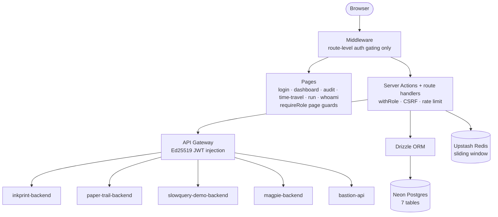
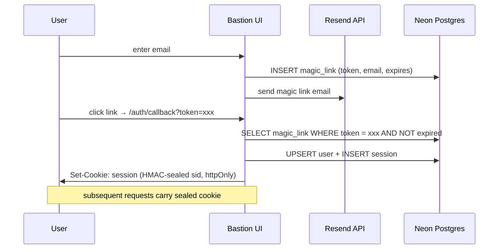
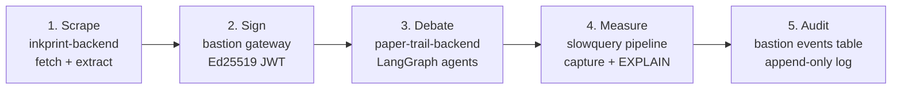
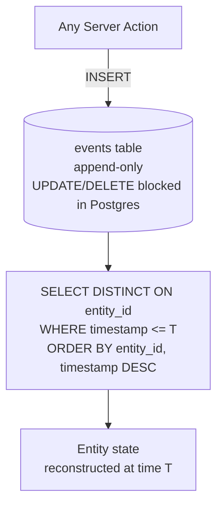

# 🏰 `bastion`

> 🛡️ **Control plane + identity + audit + demo runner for the muizz-lab portfolio.**
> Not a landing page — a full-stack Next.js control plane that proves 5 microservices work together.

🌐 [Live Demo](https://bastion-six.vercel.app) · 📖 [Architecture](docs/ARCHITECTURE.md) · 🎬 [Demo Script](docs/DEMO.md) · ❓ [Why](WHY.md)


[](https://github.com/Abdul-Muizz1310/bastion/actions/workflows/ci.yml)


---

```console
$ open https://bastion-six.vercel.app

[auth]       magic link sent → inbox → callback → session sealed
[registry]   5 services discovered · 4 healthy · 1 cold-starting
[gateway]    Ed25519 JWT minted · TTL 60s · forwarding to paper-trail
[demo]       step 1/5: scrape → sign → debate → measure → audit
[audit]      12 events logged · INSERT-only · no UPDATE/DELETE
[replay]     time-travel to 2026-04-13T09:41:00Z → entity reconstructed
```

---

## 🎯 Why this exists

A portfolio of independent microservices needs proof they work **together**, not just individually. Bastion is that proof — a single entry point that authenticates users, routes traffic through an API gateway, runs a cross-service demo workflow, and logs every action to an append-only audit trail.

It is **not** a landing page. It is a real control plane with real auth, real RBAC, real rate limiting, and a real database.

---

## ✨ Features

- 🔐 Magic link authentication via Resend + HMAC-sealed session cookies
- 👥 3-tier RBAC (admin / editor / viewer) enforced in page guards (`requireRole()`) and Server Actions (`withRole()`)
- 📡 Service registry over 5 services — 4 probed with live health checks, feathers is CLI-only
- 🌉 API gateway with Ed25519 JWT injection via jose
- 📝 Append-only audit log — `UPDATE`/`DELETE`/`TRUNCATE` on `events` are rejected by Postgres itself
- ⏪ Time-travel replay via `DISTINCT ON` — debounced slider reconstructs entity state at any past timestamp
- 🎬 Integrated 5-step demo runner (scrape → sign → debate → measure → audit)
- 🛡️ 11-item security posture panel at `/whoami` (RBAC, CSRF double-submit, rate limiting, CSP, httpOnly, no PII in cookies)
- ⏱️ Rate limiting via Upstash Redis sliding window
- 🧪 594 unit tests (Vitest), 87.81% line coverage
- 🚀 Deployed on Vercel

---

## 🏗️ Architecture


```mermaid
flowchart TD
    Browser([Browser]) --> MW[Middleware<br/>route-level auth gating only]
    MW --> Pages[Pages<br/>login · dashboard · audit · time-travel · run · whoami<br/>requireRole page guards]
    MW --> Actions[Server Actions + route handlers<br/>withRole · CSRF · rate limit]
    Actions --> Gateway[API Gateway<br/>Ed25519 JWT injection]
    Gateway --> S1[inkprint-backend]
    Gateway --> S2[paper-trail-backend]
    Gateway --> S3[slowquery-demo-backend]
    Gateway --> S4[magpie-backend]
    Gateway --> S5[bastion-api]
    Actions --> Drizzle[Drizzle ORM]
    Drizzle --> Neon[(Neon Postgres<br/>7 tables)]
    Actions --> Upstash[(Upstash Redis<br/>sliding window)]
```

### 🔐 Auth flow


```mermaid
sequenceDiagram
    participant User
    participant Bastion as Bastion UI
    participant Resend as Resend API
    participant DB as Neon Postgres

    User->>Bastion: enter email
    Bastion->>DB: INSERT magic_link (token, email, expires)
    Bastion->>Resend: send magic link email
    User->>Bastion: click link → /auth/callback?token=xxx
    Bastion->>DB: SELECT magic_link WHERE token = xxx AND NOT expired
    Bastion->>DB: UPSERT user + INSERT session
    Bastion->>User: Set-Cookie: session (HMAC-sealed sid, httpOnly)
    Note over User,Bastion: subsequent requests carry sealed cookie
```

### 🎬 Demo runner pipeline


```mermaid
flowchart LR
    Step1[1. Scrape<br/>inkprint-backend<br/>fetch + extract] --> Step2[2. Sign<br/>bastion gateway<br/>Ed25519 JWT]
    Step2 --> Step3[3. Debate<br/>paper-trail-backend<br/>LangGraph agents]
    Step3 --> Step4[4. Measure<br/>slowquery pipeline<br/>capture + EXPLAIN]
    Step4 --> Step5[5. Audit<br/>bastion events table<br/>append-only log]
```

### 📝 Audit + time-travel


```mermaid
flowchart TD
    Action[Any Server Action] -->|INSERT| Events[(events table<br/>append-only<br/>UPDATE/DELETE blocked in Postgres)]
    Events --> Query[SELECT DISTINCT ON entity_id<br/>WHERE timestamp <= T<br/>ORDER BY entity_id, timestamp DESC]
    Query --> Snapshot[Entity state<br/>reconstructed at time T]
```

---

## 🗂️ Project structure

```
src/
├── proxy.ts                          # Route-level auth gating + public-path allowlist
├── app/
│   ├── page.tsx                      # Landing
│   ├── layout.tsx                    # Root layout + session provider
│   ├── actions.ts                    # Server actions (all mutations)
│   ├── (app)/                        # Authenticated routes
│   │   ├── dashboard/page.tsx        # Service registry + health
│   │   ├── audit/page.tsx            # Append-only audit log viewer
│   │   ├── audit/[requestId]/page.tsx
│   │   ├── time-travel/page.tsx      # DISTINCT ON replay UI
│   │   ├── run/page.tsx              # Integrated demo runner
│   │   ├── dossiers/[id]/page.tsx    # Signed dossier detail
│   │   ├── services/[id]/page.tsx    # Per-service view
│   │   └── whoami/page.tsx           # Current session info
│   │   ├── forbidden.tsx             # Styled 403 interrupt page
│   │   └── unauthorized.tsx          # Styled 401 interrupt page
│   ├── (public)/                     # Login + magic-link callback
│   │   ├── login/page.tsx
│   │   └── auth/callback/route.ts
│   └── api/                          # Route handlers
│       ├── csrf/route.ts             # Double-submit token mint
│       ├── dossiers/route.ts         # + [id]/verify, [id]/stream
│       ├── health/ · status/         # Liveness + registry status
│       ├── proxy/[service]/[...path] # Gateway proxy
│       └── public-key/route.ts       # Ed25519 public key
├── lib/
│   ├── auth/                         # session, magic-link, rbac, csrf, return-to
│   ├── audit/                        # write (appendEvent), replay (time-travel)
│   ├── gateway/                      # jwt (Ed25519), client (proxy), services
│   ├── db/                           # Drizzle schema + Neon client
│   ├── rate-limit/                   # Upstash sliding window
│   ├── csrf-client.ts                # Browser-side CSRF fetch helper
│   ├── registry.ts                   # Service manifest + health checks
│   └── validation.ts                 # Shared Zod schemas
├── features/
│   ├── dossier/                      # Cross-service dossier pipeline (server + components)
│   ├── time-travel/                  # Replay controller, slider, Server Action
│   └── audit/                        # Audit query
└── components/
    └── terminal/                     # AppNav, PageFrame, StatusBar, TerminalWindow
```

---

## 🛠️ Stack

| Concern | Choice |
|---|---|
| **Framework** | Next.js 16 (App Router, Server Actions — no separate backend) |
| **UI** | React 19 · TypeScript strict |
| **Auth** | HMAC-sealed session cookies · magic link via Resend |
| **RBAC** | 3 roles (admin / editor / viewer) · `requireRole()` page guards + `withRole()` in Server Actions |
| **Database** | Neon Postgres via Drizzle ORM (7 tables: users, sessions, magic_links, events, dossiers, evidence_items, dossier_events) |
| **Rate limiting** | Upstash Redis sliding window |
| **JWT** | Ed25519 via jose |
| **Testing** | Vitest (594 unit tests, 87.81% coverage) |
| **Lint / Format** | Biome |
| **Hosting** | Vercel |

---

## 🔐 Security checklist

| # | Control | Implementation |
|---|---|---|
| 1 | RBAC | 3-tier role enforcement via `requireRole()` page guards and `withRole()` in Server Actions — middleware only authenticates |
| 2 | CSRF | Double-submit cookie pattern on the mutating route handlers (`POST /api/dossiers`, gateway proxy); Server Actions additionally get Next's built-in origin check |
| 3 | Rate limiting | Upstash Redis sliding window on auth (10/min, fail-closed), gateway (60/min, fail-open) and CSRF minting (30/min) |
| 4 | CSP | Content-Security-Policy + `Permissions-Policy` set in `next.config.ts` `headers()` |
| 5 | httpOnly cookies | HMAC-sealed, httpOnly, secure, sameSite=lax |
| 6 | No PII in cookies | Session cookie contains only an opaque session id (`sid`) — no email, role, or name — HMAC-sealed |
| 7 | Magic link expiry | Tokens expire after 15 minutes, single-use |
| 8 | Append-only audit | `REVOKE UPDATE/DELETE/TRUNCATE` + `BEFORE UPDATE/DELETE/TRUNCATE` triggers on `events` (`drizzle/0001_append_only_events.sql`) — rejected by Postgres, not by app code |
| 9 | JWT short-lived | Ed25519 tokens with 60s TTL |
| 10 | Input validation | Zod schemas on all Server Action inputs |
| 11 | Error boundaries | No stack traces or internal state leaked to client |

---

## 🚀 Run locally

```bash
# 1. clone & install
git clone https://github.com/Abdul-Muizz1310/bastion.git
cd bastion
pnpm install

# 2. env
cp .env.example .env.local
# fill in DATABASE_URL, IRON_SESSION_PASSWORD, RESEND_API_KEY,
# UPSTASH_REDIS_REST_URL, UPSTASH_REDIS_REST_TOKEN

# 3. dev
pnpm dev
# → http://localhost:3000
```

### 📜 Scripts

```bash
pnpm dev          # Next.js dev server
pnpm build        # production build
pnpm start        # production server
pnpm test         # Vitest unit tests
pnpm test:integration  # Postgres-backed tier (skips when DATABASE_URL is unset)
pnpm bench        # Gateway Ed25519 JWT mint throughput
pnpm lint         # Biome check
pnpm format       # Biome write
```

---

## 🧪 Testing

```bash
pnpm test                    # unit tier, single run (Vitest)
pnpm test:watch              # unit tier, watch mode
pnpm test:coverage           # unit tier + v8 coverage gate
pnpm test:integration        # Postgres tier — skips when DATABASE_URL is unset
pnpm test:e2e                # Playwright
```

Three tiers, all run in CI (`.github/workflows/ci.yml`): unit with a coverage
gate, an integration tier against a real Postgres (this is what proves the
`events` table rejects `UPDATE`/`DELETE`/`TRUNCATE`), and Playwright end-to-end.

| Metric | Value |
|---|---|
| **Unit tests** | 594 (Vitest) |
| **Line coverage** | **87.81%** |
| **Methodology** | Red-first spec-TDD. Failing test before every feature. |

Reproducible performance numbers live in [`benchmarks/`](benchmarks/README.md) (`pnpm bench`).

---

## 📐 Engineering philosophy

| Principle | How it shows up |
|---|---|
| 🧪 **Spec-TDD** | Every feature ships with a red test first. |
| 🛡️ **Negative-space programming** | Append-only audit (illegal states unrepresentable at DB level), `Literal` role types, Zod at every Server Action boundary. |
| 🏗️ **Separation of concerns** | `app/` thin pages + Server Actions · `lib/` pure helpers (`auth/`, `audit/`, `gateway/`, `db/`) · `features/` domain logic. No cross-layer reaches. |
| 🔤 **Typed everything** | TypeScript strict. Drizzle typed schema. Zod-inferred types. No `any`. |
| 🌊 **Pure core, imperative shell** | RBAC checks, JWT mint, time-travel queries = pure. DB/Redis/Resend calls at edges only. |
| 🎯 **One responsibility per module** | `lib/auth/` does auth. `lib/gateway/` does the gateway. `lib/audit/` does audit. Never "and". |

---

## 🚀 Deploy

Hosted on **Vercel**. Push to `main` → Vercel build → auto-deploy.

Required env vars:
- `DATABASE_URL` (Neon Postgres)
- `IRON_SESSION_PASSWORD` (32+ char secret)
- `RESEND_API_KEY`
- `UPSTASH_REDIS_REST_URL` + `UPSTASH_REDIS_REST_TOKEN`

---

## 📄 License

MIT. See [LICENSE](LICENSE).

---

> 🏰 **`bastion --help`** · one control plane to rule them all
