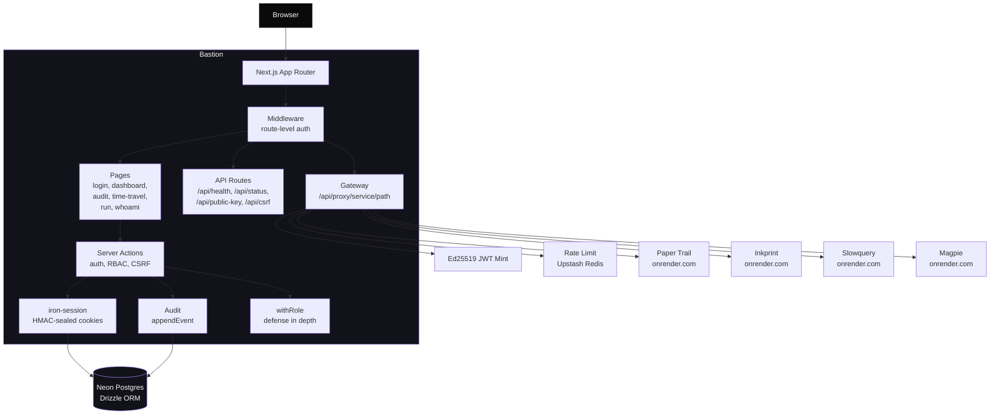

# Architecture

## Layers

| Layer | Responsibility | Key files |
|---|---|---|
| Middleware | Route-level auth gating, public path allowlist | `src/middleware.ts` |
| Pages | UI rendering, Server Components | `src/app/*/page.tsx` |
| Server Actions | Auth, RBAC, CSRF, mutations | `src/lib/auth.ts`, `src/lib/rbac.ts` |
| Session | HMAC-sealed cookie, DB-backed validation | `src/lib/session.ts` |
| Audit | Append-only event log, time-travel query | `src/lib/audit.ts`, `src/lib/replay.ts` |
| Gateway | JWT minting, request ID, service proxy | `src/lib/gateway.ts` |
| Rate Limit | Upstash sliding window, fail-open | `src/lib/rate-limit.ts` |
| Schema | Drizzle ORM, 4 tables, append-only grant | `src/lib/schema.ts` |
| Registry | Hardcoded manifest, parallel health checks | `src/lib/services.ts`, `src/lib/registry.ts` |

## Data model

4 tables on Neon Postgres (shadow-admin branch):

- `users` — id, email, name, role (admin/editor/viewer), soft delete
- `sessions` — id, userId FK, expiresAt, ip, userAgent
- `magic_links` — token PK, email, expiresAt, usedAt (single-use)
- `events` — bigserial PK, actorId, action, entityType, entityId, service, requestId, before/after JSONB, metadata JSONB, createdAt. **INSERT only** — no UPDATE or DELETE at DB level.

## Security boundaries

1. Cookie: HMAC-sealed `{sid}` only — no PII
2. Middleware: route-level auth gating
3. withRole(): Server Action defense in depth
4. CSRF: double-submit token
5. Rate limit: Upstash sliding window (10/min auth, 60/min gateway)
6. Audit: append-only at DB level
7. Gateway: Ed25519 JWT with 60s TTL
8. Headers: CSP, X-Frame-Options: DENY, X-Content-Type-Options: nosniff
