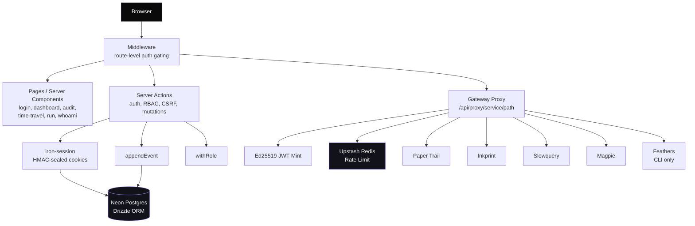
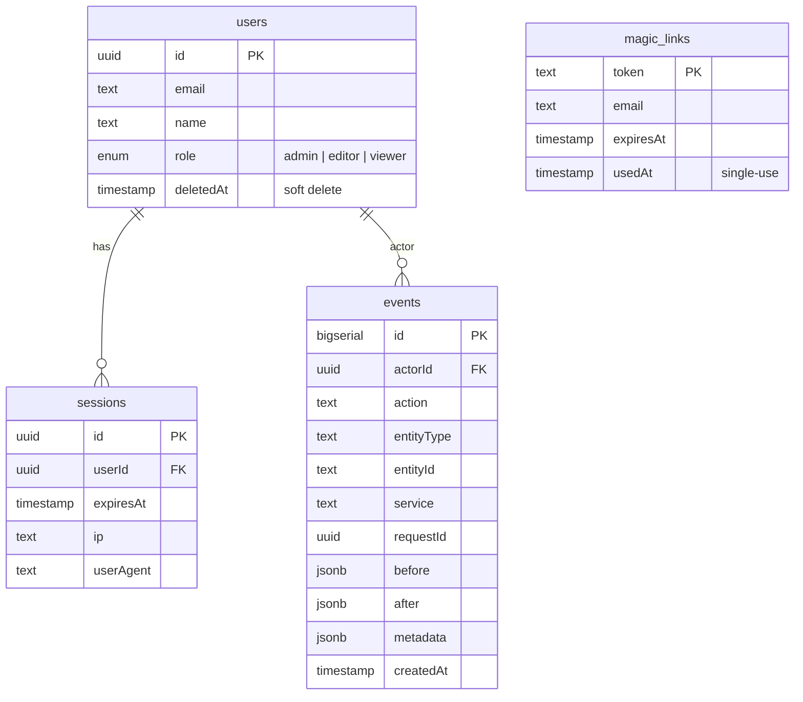
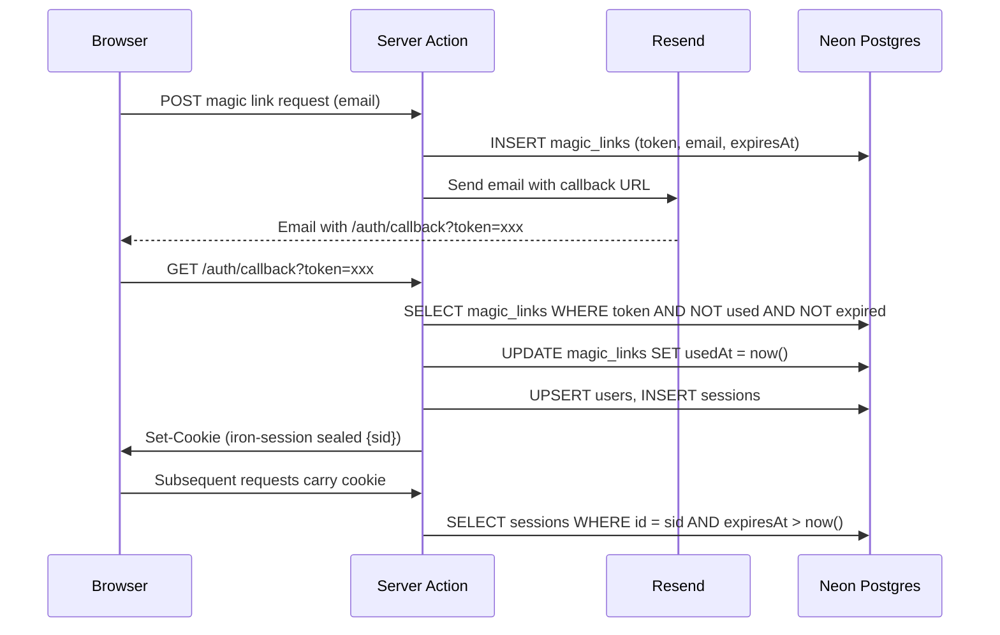
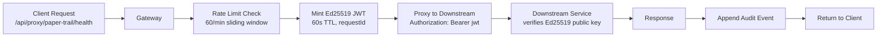

# Architecture

Bastion is a control plane for five microservices. It is a full-stack Next.js 16 application using Server Actions as the backend layer — no separate API server.

## System overview



## Component map

| Component | Purpose | Key files |
|---|---|---|
| Middleware | Route-level auth gating, public path allowlist | `src/middleware.ts` |
| Pages | UI rendering via React Server Components | `src/app/*/page.tsx` |
| Server Actions | Auth, RBAC, CSRF enforcement, all mutations | `src/lib/auth.ts`, `src/lib/rbac.ts`, `src/lib/csrf.ts` |
| Session | HMAC-sealed cookie with DB-backed validation | `src/lib/session.ts` |
| Auth | Magic link request/callback, demo-mode bypass | `src/lib/auth.ts` |
| RBAC | `withRole()` defense-in-depth wrapper | `src/lib/rbac.ts` |
| CSRF | Double-submit token generation and verification | `src/lib/csrf.ts` |
| Rate Limit | Upstash sliding window, fail-open on error | `src/lib/rate-limit.ts` |
| Audit | Append-only event log, `appendEvent()` | `src/lib/audit.ts` |
| Replay | Time-travel query over immutable events | `src/lib/replay.ts` |
| Gateway | JWT minting, request ID injection, service proxy | `src/lib/gateway.ts` |
| Registry | Service manifest, parallel health checks | `src/lib/registry.ts`, `src/lib/services.ts` |
| Demo | End-to-end cross-service workflow runner | `src/lib/demo.ts` |
| Schema | Drizzle ORM table definitions, append-only grant | `src/lib/schema.ts` |
| Validation | Shared Zod schemas for form inputs | `src/lib/validation.ts` |

## Database schema

4 tables on Neon Postgres (`shadow-admin` branch):



## Auth flow



## Gateway proxy



## Security invariants

1. Cookie contains only `{sid}` — no PII, no role, no email
2. Middleware gates every non-public route before page rendering
3. `withRole()` enforces authorization inside Server Actions (defense in depth)
4. CSRF double-submit token required on all mutations
5. Rate limiting via Upstash sliding window (10/min auth, 60/min gateway)
6. `events` table has INSERT-only grant — no UPDATE, no DELETE at DB level
7. Gateway JWTs are Ed25519-signed with 60-second TTL
8. Every gateway call gets a unique `requestId` for distributed tracing
9. `httpOnly` + `secure` + `sameSite=lax` on session cookie
10. CSP header blocks inline scripts; `X-Frame-Options: DENY`; `X-Content-Type-Options: nosniff`
11. Magic links are single-use (usedAt timestamp) with 15-minute expiry

## Layering

Bastion enforces strict layering — each concern lives in one module and does not reach across boundaries:

```
Middleware (route gating)
  -> Pages (Server Components, read-only rendering)
    -> Server Actions (mutations, auth + RBAC + CSRF checks)
      -> Session (cookie seal/unseal, DB validation)
      -> Audit (append-only event writes)
      -> Gateway (JWT mint, proxy, rate limit)
        -> Schema (Drizzle ORM, table definitions)
          -> Neon Postgres
```

Controllers (Server Actions) never touch the database directly — they go through `session.ts`, `audit.ts`, or `gateway.ts`. Pages never mutate state. The schema module owns all table definitions and the append-only invariant. Rate limiting and JWT minting are gateway-internal concerns invisible to the rest of the app.
