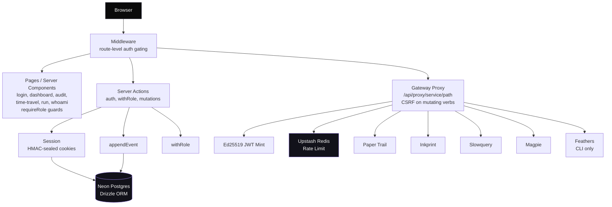
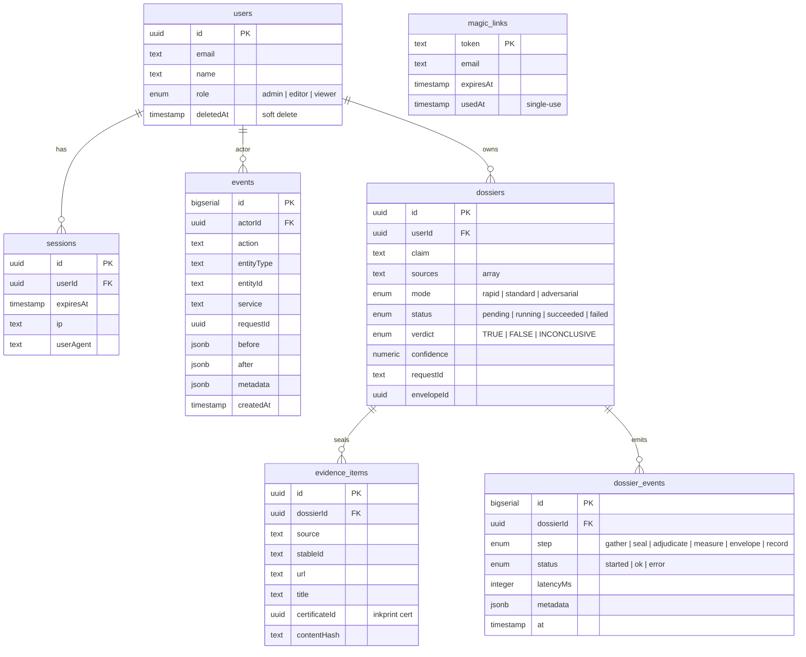
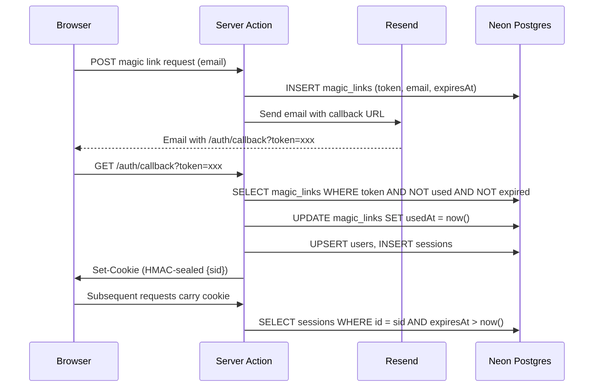
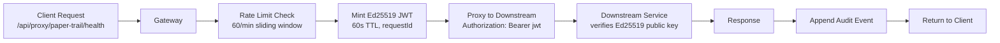

# Architecture

Bastion is a control plane for five microservices. It is a full-stack Next.js 16 application using Server Actions as the backend layer — no separate API server.

## System overview


```mermaid
flowchart TD
    Browser[Browser] --> MW[Middleware<br>route-level auth gating]
    MW --> Pages[Pages / Server Components<br>login, dashboard, audit,<br>time-travel, run, whoami<br>requireRole guards]
    MW --> SA[Server Actions<br>auth, withRole, mutations]
    MW --> GW[Gateway Proxy<br>/api/proxy/service/path<br>CSRF on mutating verbs]

    SA --> Session[Session<br>HMAC-sealed cookies]
    SA --> Audit[appendEvent]
    SA --> RBAC[withRole]

    Session --> Neon[(Neon Postgres<br>Drizzle ORM)]
    Audit --> Neon

    GW --> JWT[Ed25519 JWT Mint]
    GW --> RL[Upstash Redis<br>Rate Limit]

    GW --> PT[Paper Trail]
    GW --> IP[Inkprint]
    GW --> SQ[Slowquery]
    GW --> MG[Magpie]
    GW --> FT[Feathers<br>CLI only]

    style Browser fill:#0a0a0a,stroke:#2a2a3d,color:#fafafa
    style Neon fill:#12121a,stroke:#a78bfa,color:#fafafa
    style RL fill:#12121a,stroke:#a78bfa,color:#fafafa
```

## Component map

| Component | Purpose | Key files |
|---|---|---|
| Proxy | Route-level auth gating, public path allowlist | `src/proxy.ts` |
| Pages | UI rendering via React Server Components | `src/app/*/page.tsx` |
| Server Actions | Auth + mutations; RBAC via `withRole()`. Next's built-in origin check covers CSRF here — the explicit double-submit gate lives on the route handlers | `src/app/actions.ts`, `src/lib/auth/rbac.ts` |
| Route handlers | Mutating JSON APIs; explicit `validateCsrf()` double-submit gate | `src/app/api/dossiers/route.ts`, `src/app/api/proxy/[service]/[...path]/route.ts` |
| Session | HMAC-sealed cookie with DB-backed validation; seal primitive shared with proxy | `src/lib/auth/session.ts`, `src/lib/auth/seal.ts` |
| Auth | Magic link request/callback, demo-mode bypass | `src/lib/auth/magic-link.ts`, `src/lib/auth/return-to.ts` |
| RBAC | `requireRole()` page guards + `withRole()` action wrapper; both audit denials | `src/lib/auth/rbac.ts` |
| CSRF | Double-submit token generation and verification | `src/lib/auth/csrf.ts`, `src/lib/csrf-client.ts` |
| Rate Limit | Upstash sliding window. `authLimiter` fails **closed**; `gatewayLimiter`/`csrfLimiter` fail **open**. Construction warns once if `UPSTASH_*` is unset | `src/lib/rate-limit/index.ts` |
| Audit | Append-only event log, `appendEvent()` | `src/lib/audit/write.ts` |
| Replay | Time-travel query over immutable events, debounced slider, admin-only Server Action | `src/lib/audit/replay.ts`, `src/features/time-travel/` |
| Gateway | JWT minting, request ID injection, service proxy | `src/lib/gateway/jwt.ts`, `src/lib/gateway/client.ts` |
| Registry | Service manifest, parallel health checks for the 4 services with a `backendUrl` (feathers is CLI-only and reported without a probe) | `src/lib/registry.ts`, `src/lib/gateway/services.ts` |
| Demo | End-to-end cross-service dossier workflow runner | `src/features/dossier/server/pipeline.ts`, `src/features/dossier/server/create.ts` |
| Schema | Drizzle ORM table definitions; append-only enforcement ships as a migration | `src/lib/db/schema.ts`, `drizzle/0001_append_only_events.sql` |
| Validation | Shared Zod schemas for form inputs | `src/lib/validation.ts`, `src/features/dossier/schemas.ts` |

## Database schema

7 tables on Neon Postgres (`shadow-admin` branch): `users`, `sessions`,
`magic_links`, `events`, `dossiers`, `evidence_items`, `dossier_events`.


```mermaid
erDiagram
    users ||--o{ sessions : "has"
    users ||--o{ events : "actor"
    users ||--o{ dossiers : "owns"
    dossiers ||--o{ evidence_items : "seals"
    dossiers ||--o{ dossier_events : "emits"

    users {
        uuid id PK
        text email
        text name
        enum role "admin | editor | viewer"
        timestamp deletedAt "soft delete"
    }

    sessions {
        uuid id PK
        uuid userId FK
        timestamp expiresAt
        text ip
        text userAgent
    }

    magic_links {
        text token PK
        text email
        timestamp expiresAt
        timestamp usedAt "single-use"
    }

    events {
        bigserial id PK
        uuid actorId FK
        text action
        text entityType
        text entityId
        text service
        uuid requestId
        jsonb before
        jsonb after
        jsonb metadata
        timestamp createdAt
    }

    dossiers {
        uuid id PK
        uuid userId FK
        text claim
        text sources "array"
        enum mode "rapid | standard | adversarial"
        enum status "pending | running | succeeded | failed"
        enum verdict "TRUE | FALSE | INCONCLUSIVE"
        numeric confidence
        text requestId
        uuid envelopeId
    }

    evidence_items {
        uuid id PK
        uuid dossierId FK
        text source
        text stableId
        text url
        text title
        uuid certificateId "inkprint cert"
        text contentHash
    }

    dossier_events {
        bigserial id PK
        uuid dossierId FK
        enum step "gather | seal | adjudicate | measure | envelope | record"
        enum status "started | ok | error"
        integer latencyMs
        jsonb metadata
        timestamp at
    }
```

## Auth flow


```mermaid
sequenceDiagram
    participant B as Browser
    participant S as Server Action
    participant R as Resend
    participant DB as Neon Postgres

    B->>S: POST magic link request (email)
    S->>DB: INSERT magic_links (token, email, expiresAt)
    S->>R: Send email with callback URL
    R-->>B: Email with /auth/callback?token=xxx
    B->>S: GET /auth/callback?token=xxx
    S->>DB: SELECT magic_links WHERE token AND NOT used AND NOT expired
    S->>DB: UPDATE magic_links SET usedAt = now()
    S->>DB: UPSERT users, INSERT sessions
    S->>B: Set-Cookie (HMAC-sealed {sid})
    B->>S: Subsequent requests carry cookie
    S->>DB: SELECT sessions WHERE id = sid AND expiresAt > now()
```

## Gateway proxy


```mermaid
flowchart LR
    A[Client Request<br>/api/proxy/paper-trail/health] --> B[Gateway]
    B --> C[Rate Limit Check<br>60/min sliding window]
    C --> D[Mint Ed25519 JWT<br>60s TTL, requestId]
    D --> E[Proxy to Downstream<br>Authorization: Bearer jwt]
    E --> F[Downstream Service<br>verifies Ed25519 public key]
    F --> G[Response]
    G --> H[Append Audit Event]
    H --> I[Return to Client]
```

## Security invariants

1. Cookie contains only `{sid}` — no PII, no role, no email
2. Middleware **authenticates** every non-public route before page rendering. It performs no authorization, no CSRF check and no rate limiting — those live in the layers below
3. Authorization is enforced by `requireRole()` at the page layer and `withRole()` inside Server Actions; both write a `security.denied` audit event on refusal
4. CSRF double-submit token required on every mutating route handler — `POST /api/dossiers` and `POST/PUT/PATCH/DELETE /api/proxy/*` (minted at `GET /api/csrf`). `GET`/`HEAD`/`OPTIONS` are exempt. Server Actions additionally rely on Next's built-in same-origin check
5. Rate limiting via Upstash sliding window (10/min auth **fail-closed**, 60/min gateway fail-open, 30/min CSRF minting fail-open). A deploy without `UPSTASH_*` logs a warning at startup rather than degrading silently
6. `events` is append-only **in the database**: `UPDATE`/`DELETE`/`TRUNCATE` are revoked from `PUBLIC` and rejected by `BEFORE` triggers that raise `insufficient_privilege`, so the guarantee holds even for the table owner (`drizzle/0001_append_only_events.sql`, proven by `tests/integration/db/append-only.test.ts`)
7. Gateway JWTs are Ed25519-signed with 60-second TTL
8. Every gateway call gets a unique `requestId` for distributed tracing
9. `httpOnly` + `secure` + `sameSite=lax` on session cookie
10. CSP restricts *sources* (`default-src 'self'`, `frame-ancestors 'none'`) and drops `'unsafe-eval'` in production. It does **not** block inline scripts: Next's hydration bootstrap is inline, so `'unsafe-inline'` remains in `script-src` until a nonce pipeline exists. Set in `next.config.ts` `headers()`, not in middleware. Also `X-Frame-Options: DENY`; `X-Content-Type-Options: nosniff`
11. Magic links are single-use (usedAt timestamp) with 15-minute expiry

## Layering

Bastion enforces strict layering — each concern lives in one module and does not reach across boundaries:

```
Middleware (authentication gating only)
  -> Pages (Server Components, read-only rendering, requireRole guards)
    -> Server Actions + route handlers (mutations, withRole, CSRF on route handlers)
      -> Session (cookie seal/unseal, DB validation)
      -> Audit (append-only event writes)
      -> Gateway (JWT mint, proxy, rate limit)
        -> Schema (Drizzle ORM, table definitions)
          -> Neon Postgres (append-only triggers on `events`)
```

Controllers (Server Actions) never touch the database directly — they go through `lib/auth/session.ts`, `lib/audit/write.ts`, or `lib/gateway/`. Pages never mutate state. Rate limiting and JWT minting are gateway-internal concerns invisible to the rest of the app. The append-only invariant is owned by the database, not by the schema module: application code cannot opt out of it.
