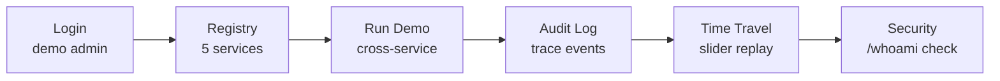

# Demo Script

Step-by-step demo for interviews. Takes ~3 minutes.

## Setup

Open https://bastion-six.vercel.app in a browser.

## 1. Login (30s)

1. Land on `/login` — show the magic link form and demo-mode buttons
2. Click **admin** to sign in instantly
3. Note: "demo mode active" — real magic links work too via Resend

## 2. Service Registry (30s)

1. `/dashboard` shows 5 service cards with live health indicators
2. Green dots pulse for healthy services; red for cold/sleeping ones on Render free tier
3. Click any card to drill into `/services/[id]` — health, version, repo link, backend/frontend URLs
4. Feathers shows "CLI — see PyPI" since it's a CLI tool with no hosted backend

## 3. Integrated Demo (60s)

1. Navigate to `/run`
2. Click "Run end-to-end platform demo"
3. Watch 5 steps execute sequentially via the bastion gateway:
   - magpie: scrape a Hacker News article
   - inkprint: sign a C2PA certificate
   - paper-trail: run a 3-round AI debate
   - slowquery: capture slow query fingerprints
   - audit: collect the cross-service event trail
4. All calls go through `/api/proxy/[service]/...` with Ed25519 JWT injection

## 4. Audit Log (30s)

1. Navigate to `/audit`
2. See all demo events with the same `request_id`
3. Filter by service to isolate one service's events
4. Note: append-only — INSERT only at DB level, no UPDATE or DELETE

## 5. Time Travel (30s)

1. Navigate to `/time-travel`
2. Drag the slider to before the demo — events disappear
3. Drag to after — events reappear
4. Query: `DISTINCT ON (entity_type, entity_id) WHERE created_at <= $T`

## 6. Security (/whoami) (30s)

1. Navigate to `/whoami`
2. Show session info: role, expiry, cookie contents
3. Cookie decoder proves only `{sid}` is stored — no PII
4. Security checklist: 11 items all green
5. Check response headers in DevTools: CSP, X-Frame-Options: DENY

## Talking points

- **Full-stack Next.js 16** — Server Actions are the backend, no FE/BE split
- **Production security patterns** — RBAC, CSRF, rate limiting, append-only audit
- **Distributed tracing** — single request ID across 5 services
- **Ed25519 JWT gateway** — bastion signs, backends verify
- **Time travel** — DISTINCT ON replay over immutable events
